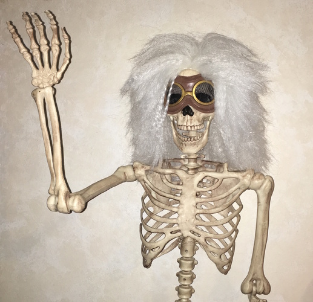

class: center, middle, orange

# CV Workshop 👔

---

# What is the goal?

---

# Find a great job 🤑

---

class: center, middle, black

---

# Money only last for so long 😰

---

class: center, middle, black

# "Arbejdsglæde" 🙌

---

# CV is a way to start that conversation

---

# What are employers looking for?

---

## - That you are relevant for a second view

## - That you are normal

## - That you don’t lie about how you are

## - Something that we can remember

---

# CV = curriculum vitae

## [the] course of [my] life

---

# What are important to have?

---

# ✅ Recent relevant information

---

# 🆘 Don’t include what you did 15 years ago if it doesn’t define you

---

# 🆘 Don’t have a long list of skills

---

# ✅ Do include a picture

### Just to show you can choose a good picture

---

# ✅ Include a hobby or achievement

---

class: black, center, middle

# How should it be formatted?

---

# ✅ Find a template

---

# ✅ Use .PDF

# 😖 .DOC

---

# 🤔 Fancy symbols

---

# ✅ Use sans-serif

---

# How long should it be?

---

# 👌 1 page max 2

---

# ✂️ If difficult cut out the most unnecessary

---

class: center, middle, black

# How should your image look like?

---

---

---

# ✅ Have it be color and not to bright

---

class: center, middle, black

# What contact information?

---

# Where you live, good to know if you apply from Copenhagen or Jutland

---

# Don't have a weird email

---

class: middle, center

## superdreng2004@yahoo.dk

### 😂

---

# Solution: Create a new, forward the emails

---

# Grammar check

### Grammarly.com

---

class: center, middle, black

# What does a successful approach look like?

---

# Applying to jobs online

???

# Applying to a job online is rough and you are judged in a rush

---

# Seriousness?

???

# It is difficult to know if you are serious or mass applying to jobs because you have to

---

# Don't hand deliver it

---

# ✅ Do ask questions!

---

class: center, middle, black

# Good things to do

---

# Connect on social media with the company

---

# Figure out a way to speak with them in real life

---

# Be honest about what you have done

---

# Be humble and be confident

# = winner strategy

---

# And remember;

# it is a conversation!

---

class: center, middle, purple

# My story

???

Got a student job through 9 grade
Got to know them more through High School
They asked for help and I said I was interested
Got fired because of not enough to do
Found a job in Copenhagen
Moved to Copenhagen
Began joining meetups
Got to know new companies
Meet new friends
Found jobs through friends

---

# Connected Cars

---

class: center, middle, black

# What did we learn?

???

CV is a good start
It is not the end
